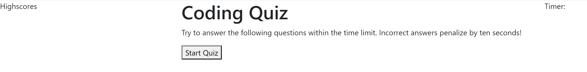

# Description
This is a coding quiz challenge. Click start quiz to start the timer, for each wrong answer, the timer will decrement 10 seconds. The quiz will not go to the next question until you select the correct answer.
Here is an image of how the site looks: 

# Deployed Site
You can find the link to the deployed site here: [Deployed Site](https://julesscheil.github.io/Javascript-Fundamentals-Quiz/)
